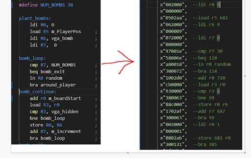
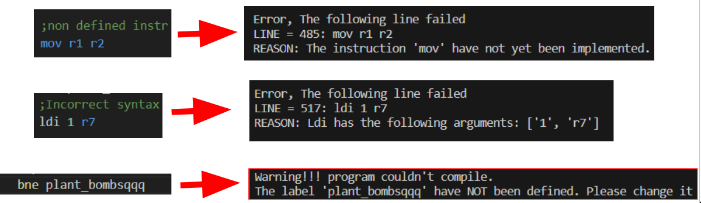

  
  

# Defined instructions:


```text

Constants will be represented by the letter 'c'.
Registers will be called Grx, where 'x' is the register number.
Memory addresses will be referred to as 'mem'. (For now, only constants can be used to my knowledge)
Input/Output is referred to as IOx.

ldi Grx c 			--Load Grx with c
add Grx mem 		--Add Grx with value in mem
add Grx, Gry 		--Add Grx with Gry
sub Grx, mem 		--Sub Grx with value in mem
and Grx, mem      	--And Operation store result in Grx
cmp Grx c, 	   		-- if equal, set Z = 1, else 0 (MAX 13 bits on c)
cmp Grx Gry      	-- if equal, set Z = 1, else 0

load Grx, mem 		--Load Grx with value in mem
load Grx, Gry		--Load memory in Grx with value in Gry
store mem, Grx    	--Store value in Grx to Mem
store Grx, Gry		--Store value in Gry into mem in Grx
out IOx, Grx 		--Load the IOx with the value in Grx

bra mem				--Jmp to mem
bne mem				--Jmp to mem if Z = 0
beq mem				--Jmp to mem if Z = 1
```

# Compiler syntax

* The compiler is case-insensitive and can process multiple spaces between arguments.
* To write comments, use ';'. 			
* To start a label, use 'label_name:'.
* To assign names to constants, use the #define instruction with the format 'name' 'value'.
* Avoid using the same name for a label and a constant, as it will result in overwriting.

# Examples
Here are some example usages
## Result of program

## Example of warnings



## Finished game written with compiler


# Naming convention

* Constants should have UPPER_CASE
* Defined memory addresses m_name
  
# If you want to add custom instructions to the compiler:
1. Open the "input_check.py" file in the "validation" folder.
2. 
3. Add the name of your new instruction and the number of arguments it requires to the "ins_args" section.
*For example: `"MY_INSTRUCTION": 3`*

4. Create a new function called "check_args_MY_INSTRUCTION(args)" to validate the arguments for your new instruction.

5. Use the "assert" statement to check the arguments' validity.

6. In the "check_valid_args" function, add an "elif" statement to the instruction is "MY_INSTRUCTION," and call the "check_args_MY_INSTRUCTION()" function.

7. After all input validation is finished, open the "compiler.py" file in the "compiling" folder.

8. Add "MY_INSTRUCTION" to operations with its corresponding operation code

9. Create a new function called "compile_MY_INSTRUCTION()" and define how it should be compiled.

10. In the "compile_line" function, add an "elsif" statement to "MY_INSTRUCTION," and call the "compile_MY_INSTRUCTION()" function.

11. Don't forget to do a unit test!


# Instructions for Usage
If you wish to retain your current pMem in the sweeper_CPU directory, follow these steps:
Run the main.py file located in the MineCompiler directory.
Find the resulting file under the code_files directory named pMem.vhd.

# Windows Script
Run the' compile_windows' file to compile and replace the pMem.vhd file directly in the sweeper_CPU directory.

# Linux Script
Execute 'chmod +x compile_linux.sh' once. Afterward, you can run './compile_linux.sh' to compile and replace the pMem in the sweeper_CPU directory with the resulting file.
